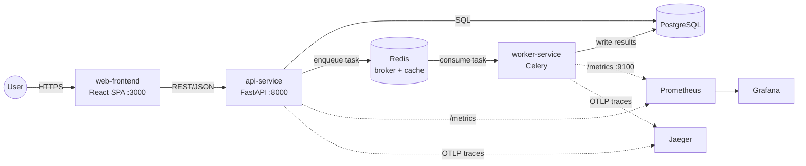

# Architecture

This document describes the system architecture of the CI/CD practice
project: the services, how they talk to each other, why they are split the
way they are, and how the topology changes as you move from a laptop to
dev/staging/production.

## 1. System Diagram

```
                                  ┌─────────────────────┐
                                  │        Users          │
                                  └──────────┬───────────┘
                                             │ HTTPS
                                  ┌──────────▼───────────┐
                                  │   web-frontend         │
                                  │   React SPA (TS)       │
                                  │   :3000                │
                                  └──────────┬───────────┘
                                             │ REST (JSON) over HTTP
                                  ┌──────────▼───────────┐
                                  │   api-service          │
                                  │   FastAPI (Python)     │
                                  │   :8000                │
                                  │   /health /metrics     │
                                  │   /api/v1/tasks        │
                                  └───┬───────────┬───────┘
                       reads/writes   │           │ enqueues jobs
                          ┌───────────▼──┐    ┌───▼─────────────┐
                          │  PostgreSQL   │    │  Redis            │
                          │  (state)      │    │  (broker + cache) │
                          └───────────────┘    └───┬─────────────┘
                                                    │ consumes jobs
                                          ┌─────────▼───────────┐
                                          │  worker-service       │
                                          │  Celery (Python)      │
                                          │  :9100 (metrics only) │
                                          └─────────┬─────────────┘
                                                    │ writes results
                                          ┌─────────▼───────────┐
                                          │  PostgreSQL (shared)  │
                                          └───────────────────────┘

        Cross-cutting observability:
        ┌────────────┐   ┌──────────┐   ┌──────────────────────────────┐
        │ Prometheus  │──▶│ Grafana   │   │ Jaeger - receives real OTLP  │
        │ (scrapes    │   └──────────┘   │ traces from api-service AND │
        │  /metrics)  │                  │ worker-service (connected    │
        └────────────┘                  │ across the Celery/Redis hop);│
                                          │ in-memory storage, so history│
                                          │ is lost on container restart │
                                          └──────────────────────────────┘
```

Equivalent Mermaid form (renders in any Mermaid-aware viewer):



## 2. The three services

### api-service (FastAPI, Python) - synchronous request/response boundary
- Owns the public REST contract: `/api/v1/tasks` (CRUD), `/health`
  (liveness/readiness), `/metrics` (Prometheus exposition), and
  `/api/v1/feature-flags` (progressive-delivery flag reads).
- Talks to PostgreSQL for durable state and to Redis both as a Celery
  broker (to hand work to worker-service) and, generically, as a cache.
- Responsible for input validation (Pydantic models), request-scoped
  metrics (`api_requests_total`, `api_request_duration_seconds`), and
  structured logging.
- This is the only service a browser or external client talks to directly
  (aside from static assets served by web-frontend) - it is the trust
  boundary and the natural place to enforce authn/authz, rate limiting,
  and request validation.

### web-frontend (React + TypeScript) - presentation layer
- A single-page application that renders UI and calls api-service over
  REST (`REACT_APP_API_URL`). It holds no business logic of consequence
  and no direct datastore access - if it disappeared, the API would still
  be fully usable via curl/Postman/another client.
- Deliberately decoupled from the backend release cadence: because it only
  depends on a versioned REST contract, it can be deployed, rolled back,
  or scaled independently of api-service.

### worker-service (Celery, Python) - asynchronous execution boundary
- Consumes jobs enqueued onto Redis by api-service (e.g. `process_item`,
  `send_notification`, `generate_report` in `apps/worker-service/worker.py`)
  and executes them off the request/response path.
- Exposes only a Prometheus metrics endpoint (`:9100`); it has no public
  HTTP API and no ingress. It is scaled by queue depth, not by request
  rate.
- Writes results back to PostgreSQL (the same logical database as
  api-service, so both sides observe the same task state).

## 3. Data stores

| Store       | Used by                    | Purpose                                                        |
|-------------|-----------------------------|------------------------------------------------------------------|
| PostgreSQL  | api-service, worker-service | System of record: tasks and any durable domain state.            |
| Redis       | api-service, worker-service | Celery broker (`/0`) + result backend (`/1`); also general cache. |

Both services share one logical Postgres database in this scaffold. In a
stricter microservices architecture you would give each service its own
schema/database and communicate through APIs or events rather than a
shared table - see the "why this topology" discussion below for the
trade-off this project deliberately accepts.

## 4. Why this topology

### Service boundaries
The split follows a **synchronous vs. asynchronous** line, not a
"one service per database table" line:
- **api-service** is the synchronous boundary: it must respond quickly, so
  anything slow (report generation, notification delivery, heavier
  processing) is handed off rather than done inline.
- **worker-service** is the asynchronous boundary: it can take seconds or
  minutes per job, retried independently, without holding open an HTTP
  connection or an API-service worker thread.
- **web-frontend** is separated because its release cadence, build
  toolchain (Node/Webpack/Vite vs. Python), and scaling profile (CDN-able
  static assets + client-side rendering) are entirely different from a
  Python API process. Bundling it with api-service would force every
  frontend change through a Python CI pipeline and vice versa.

This is a deliberately small, teachable microservices split. A larger
production system would likely also separate: an auth service, a
notification/delivery service (rather than a task type inside
worker-service), and potentially split "read" and "write" paths. The point
of keeping it to three services here is to demonstrate the *pattern*
(sync API / async worker / presentation tier) without the operational
overhead of a dozen repos.

### Sync (api-service <-> client) vs async (api-service -> worker-service via Celery/Redis)
- Synchronous REST is used where the caller needs an answer now (create a
  task, read a task, health checks).
- Celery + Redis is used where the work is slow, retryable, or
  fire-and-forget (sending a notification, generating a report). Redis
  acts purely as the transport (broker) and short-lived result store, not
  as a system of record - Postgres remains that.
- Trade-off being demonstrated: decoupling via a queue improves API
  latency and resilience (a slow/failing worker doesn't take down the
  API), at the cost of eventual consistency and additional operational
  surface (you now must monitor queue depth and worker health, not just
  request latency).

## 5. Environment promotion model

```
  feature branch --PR--> develop --merge--> main
        │                    │                 │
        │ CI: quality, unit  │                 │
        │ tests, build,      │                 │
        │ container scan     │                 │
        ▼                    ▼                 ▼
   (no deploy)          deploy-dev        deploy-staging --> e2e tests
                    (namespace: development)  (namespace: staging)
                                                      │
                                                      ▼
                                              deploy-production
                                           (namespace: production,
                                            blue/green switch)
                                                      │
                                                      ▼
                                            performance-test (k6)
```

- **dev** exists to catch integration problems early with a fast feedback
  loop; it deploys from `develop` and runs a minimal smoke test.
- **staging** is the last environment before production and is where E2E
  tests run against a deployed, running system (not mocks) - it should be
  as close to production shape (replica counts aside) as practical.
- **production** is reached only after staging + its E2E suite pass, and
  uses blue/green rather than a plain rolling update specifically because
  the blast radius of a bad production deploy is highest here - see
  `docs/ci-cd-pipeline.md` and `docs/exam-prep-notes.md` for the
  blue/green mechanics and trade-offs.
- Promotion is git-branch-driven (`develop` -> dev, `main` -> staging ->
  production) rather than manual per-environment tagging, which is a
  reasonable default for a small team but does mean environment identity
  is coupled to branch naming - larger orgs often decouple this with
  explicit release tags or a promotion UI (e.g. Argo CD's app-of-apps, or
  a manual "promote" approval gate, both of which this workflow currently
  lacks - it will auto-promote to staging then production on every merge
  to `main` with no manual approval step).

## 6. Scaling considerations

- **api-service**: stateless. Task state lives in Postgres
  (`apps/api-service/database.py` + `models.py`, an async SQLAlchemy
  engine talking to the `postgres` container via `asyncpg`) rather than in
  process memory - a task survives an api-service restart and would
  survive scaling to multiple replicas/pods, since all instances share the
  one Postgres database. Table creation currently happens via
  `Base.metadata.create_all()` in the app's `lifespan` startup handler
  (with a short retry loop for the case where Postgres's container has
  started but isn't yet accepting connections) rather than versioned
  migrations - fine for this practice project, but a real system would use
  Alembic so schema changes are reviewable and reversible instead of
  implicit. Once backed by Postgres, api-service scales horizontally
  behind the Kubernetes Service/Ingress with no special coordination
  needed.

  Before this was wired up, `tasks_db` was a plain in-memory dict, and
  that in-memory-state problem was not just theoretical:
  `Dockerfile.api-service` originally ran `uvicorn --workers 4`, spawning
  4 independent OS processes in the *same* container, each with its own
  copy of `tasks_db` and its own Prometheus counters. A task created via a
  request landed on process A would appear to vanish on a GET routed to
  process B, and `/metrics` would reflect whichever single process
  happened to serve that particular request. Fixed to `--workers 1` at
  the time; now that task state itself lives in Postgres rather than
  per-process memory, that constraint is specifically about the
  Prometheus counters/histograms (still per-process, still not
  multiprocess-safe) - a real fix there would use
  `prometheus_client`'s multiprocess mode, not just `--workers 1`.
- **worker-service**: scales by **queue depth**, not CPU/request rate -
  the right autoscaling signal is Celery queue length (or Redis list
  length) rather than raw CPU, since a worker can be CPU-idle while a
  queue backs up (e.g. waiting on I/O per task).
- **web-frontend**: effectively static once built; scales trivially
  (replica count or, better, a CDN in front of pre-built assets) and is
  rarely the bottleneck.
- **PostgreSQL / Redis**: neither is horizontally scaled in this scaffold
  (single `postgres:15-alpine` and `redis:7-alpine` container each). In
  production you would separate these into managed services (RDS/Cloud
  SQL, ElastiCache/Memorystore) with their own HA, backup, and scaling
  story - this repo's docker-compose setup is a development convenience,
  not a production data-tier design.
- **Cross-service**: because api-service and worker-service communicate
  only through Redis (never directly), either side can be redeployed,
  restarted, or scaled independently without the other needing to know -
  this is the main structural payoff of the async boundary described
  above.
